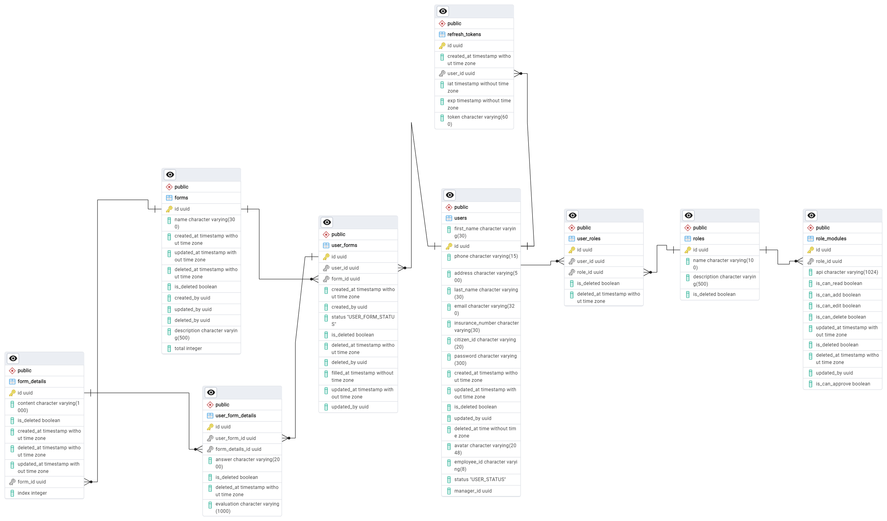
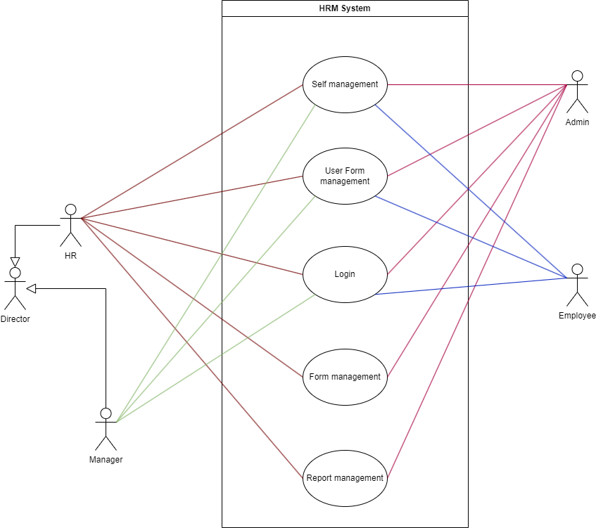

# IT1-2024 Node.js Project

## Description

This is a Node.js project template configured with TypeScript, Express, Sequelize, and other useful tools for building robust and scalable applications. The project includes setup for linting, formatting, testing, and building the application.

## Table of Contents

- [IT1-2024 Node.js Project](#it1-2024-nodejs-project)
  - [Description](#description)
  - [Table of Contents](#table-of-contents)
  - [Installation](#installation)
  - [Scripts](#scripts)
  - [Usage](#usage)
  - [Database](#database)
  - [Usecase diagram](#usecase-diagram)
  - [License](#license)

## Installation

1. Clone the repository:

   ```bash
   git clone <repository-url>
   ```

2. Navigate to the project directory:

   ```bash
   cd it1-2024-nodejs-project
   ```

3. Install the dependencies:

   ```bash
   npm install
   ```

## Scripts

- `dev`: Starts the application in development mode using `nodemon`.

  ```bash
  npm run dev
  ```

- `build`: Cleans the `dist` directory and compiles TypeScript files.

  ```bash
  npm run build
  ```

- `start`: Runs the compiled JavaScript files from the `dist` directory.

  ```bash
  npm start
  ```

- `lint`: Runs ESLint to check for linting errors.

  ```bash
  npm run lint
  ```

- `lint:fix`: Runs ESLint and automatically fixes linting errors.

  ```bash
  npm run lint:fix
  ```

- `prettier`: Checks code formatting using Prettier.

  ```bash
  npm run prettier
  ```

- `prettier:fix`: Formats the code using Prettier.

  ```bash
  npm run prettier:fix
  ```

- `test`: Runs tests using Jest.

  ```bash
  npm test
  ```

- `test:watch`: Runs tests in watch mode with code coverage using Jest and NYC.

  ```bash
  npm run test:watch
  ```

## Usage

1. Start the development server:

```bash

 npm run dev
```

2. Build the project:

   ```bash

   npm run build
   ```

3. Start the production server:

```bash

npm start
```

## Database



## Usecase diagram



## License

This project is licensed under the ISC License.
